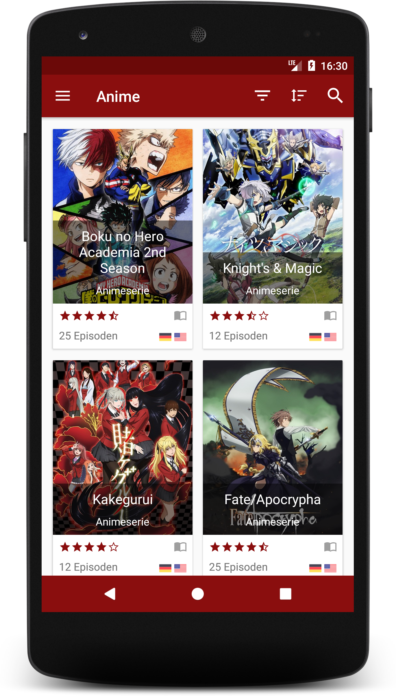
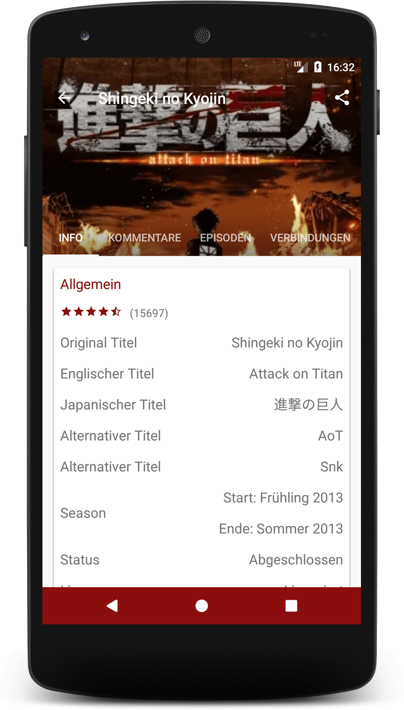
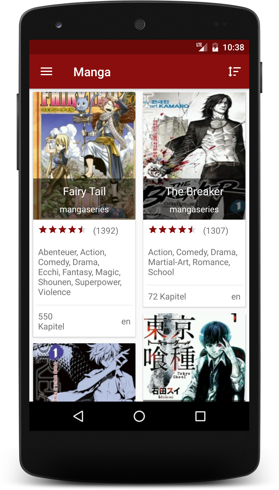
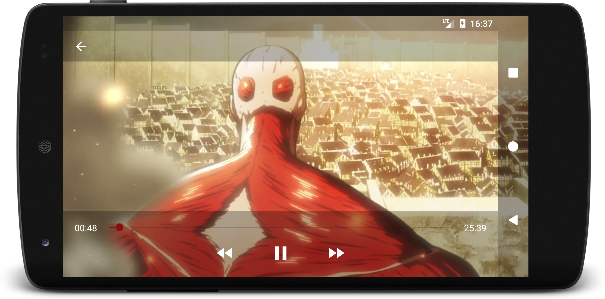
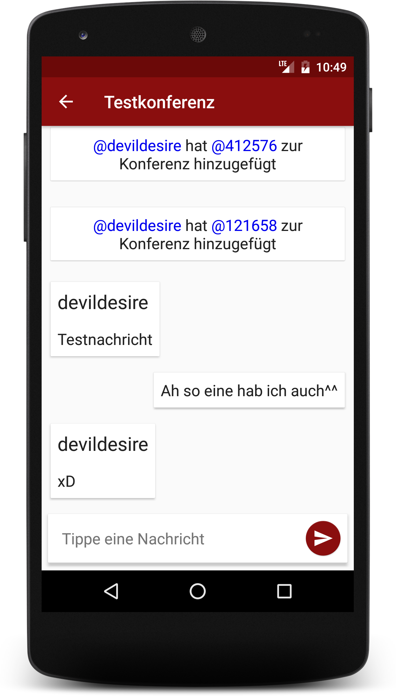
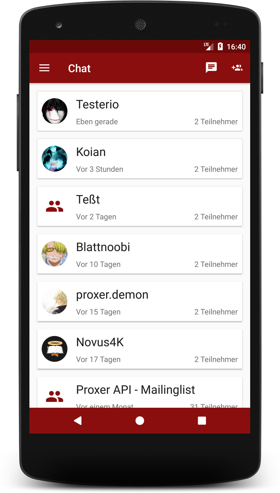
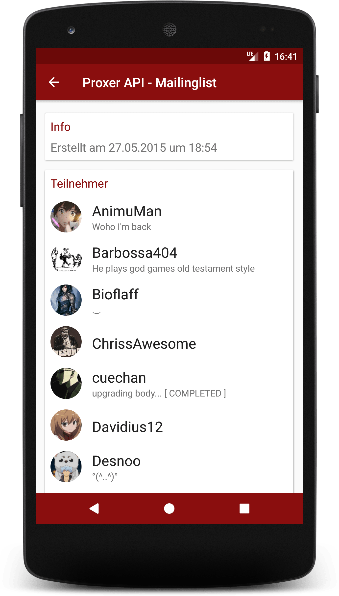
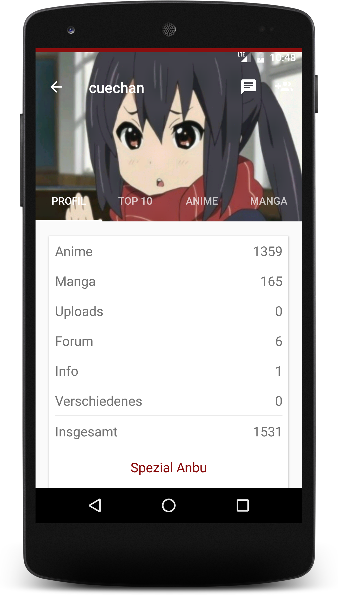
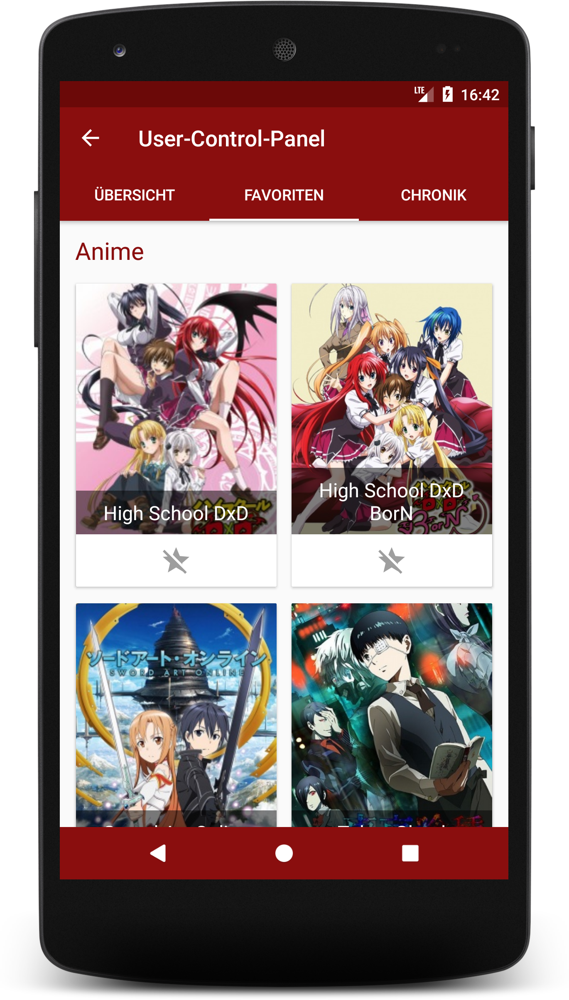
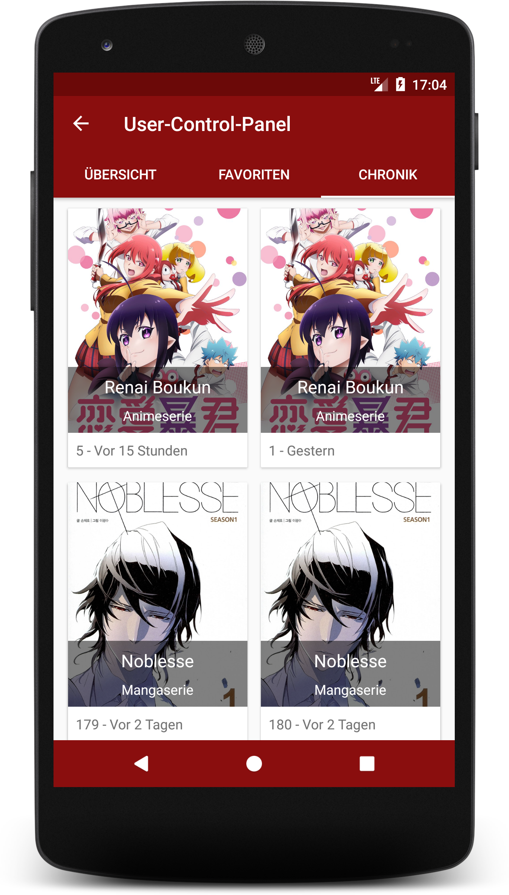

# Proxer.Me Android [](https://github.com/proxer/ProxerAndroid/releases/latest) [](https://circleci.com/gh/proxer/ProxerAndroid)

### What is this?

This is a client for the german Anime & Manga page [Proxer.Me](https://proxer.me/).<br>
It features the most important functionalities including an anime player for various hosters and languages, a mobile-friendly vertical manga reader, offline synchronized chat and much more.

### How to use it?

Build the project and install it on your device or download the [latest release](https://github.com/proxer/ProxerAndroid/releases) and install it on your device.

#### Building yourself

Assuming that you know how to use [Git](https://git-scm.com/), have the [Android SDK](https://developer.android.com/sdk/index.html) and the [Java SDK](http://www.oracle.com/technetwork/java/javase/overview/index.html) installed, run the following commands:

- `git clone https://github.com/proxer/ProxerAndroid`
- `cd ProxerAndroid`

This app needs an API-key to work. You can request one from the admins at Proxer. You then need to create a `secrets.properties` file in the root of the project with the following contents:

```
PROXER_API_KEY = YourApiKey
```

This app offers two variants to build: `debug` and `release`.<br>
It is strongly advertised to only use the `release` variant as it is faster and does not log any information.

Before building, you have to [generate a key](https://developer.android.com/studio/publish/app-signing.html#generate-key) for signing the app if you have none yet.<br>
Add these fields to your `secrets.properties` file:

```
RELEASE_STORE_FILE = /path/to/the/keystore
RELEASE_STORE_PASSWORD = theKeystorePassword
RELEASE_KEY_ALIAS = theAlias
RELEASE_KEY_PASSWORD = thePasswordForThatAlias
```

After that, you can build the app by running:

```bash
# Linux
./gradlew assembleRelease

# Windows
gradlew.bat assembleRelease
```

You can find the app in the `app/build/outputs/apk/release/` folder.<br>
It is also possible to directly install the app on your device if it is connected to your computer by running:

```bash
# Linux
./gradlew installRelease

# Windows
gradlew.bat installRelease
```

If you want to build the app for testing purposes in the `debug` variant, you can run:

```bash
# Linux
./gradlew assembleDebug

# Windows
gradlew.bat assembleDebug
```

### Screenshots

|       News        |       Anime List        |       Manga List        |
| :---------------: | :---------------------: | :---------------------: |
|  |  |  |

|       Media Detail        |    Manga Reader
| :-----------------------: | :----------------:
|  | 

|     Anime Stream List      |      Anime Player       |
| :------------------------: | :---------------------: |
|  |  |

|   Instant Chat    |       Conference List        |      Conference Detail       |
| :---------------: | :--------------------------: | :--------------------------: |
|  |  |  |

|       Profile        | Profile Settings |       Profile History        |
| :------------------: | :--------------: | :--------------------------: |
|  |  |  |

### Contributions and contributors

A guide for contribution can be found [here](.github/CONTRIBUTING.md).

- [@InfiniteSoul](https://github.com/InfiniteSoul) for implementing a persistent Navigation Drawer for tablets and UI improvements.
