#  Proxer.Me Android [](https://github.com/proxer/ProxerAndroid/releases/latest) [](https://circleci.com/gh/proxer/ProxerAndroid)

### What is this?

Proxer.Me Android is the official mobile client for the german Anime & Manga page [Proxer.Me](https://proxer.me).<br>
It features major functionalities including an anime player for various hosters and languages, a mobile-friendly manga reader, offline synchronized chat and much more.

### Downloads

|  Google Play Store                           |  Proxer App Store |  Github                                |
|-------------------------------------------------------------------------|------------------------------------------------|---------------------------------------------------------------------|
| [Download](https://play.google.com/store/apps/details?id=me.proxer.app) | [Download](https://proxer.me/apps/info/3)      | [Download](https://github.com/proxer/ProxerAndroid/releases/latest) |

#### Building yourself

After having installed the following tools: 

- [Git](https://git-scm.com/download)
- [JDK](https://oracle.com/technetwork/java/javase/downloads/index.html)
- [Android SDK](https://developer.android.com/studio/#downloads)

You can run these commands:

- `git clone https://github.com/proxer/ProxerAndroid`
- `cd ProxerAndroid`

This app needs an API-key to work. You can request one from the administrators at Proxer.
You then need to create a `secrets.properties` file in the root of the project with the following contents:

```
PROXER_API_KEY = YourApiKey
```

This app offers three variants to build: `debug`, `release` and `logRelease`.<br>
It is strongly recommended to use the `release` variant as it is faster and does not log sensitive data.

Before building, [generate a key](https://developer.android.com/studio/publish/app-signing.html#generate-key)
for signing the app if you have none yet.<br>
Add these fields to your `secrets.properties` file:

```
RELEASE_STORE_FILE = /path/to/the/keystore
RELEASE_STORE_PASSWORD = theKeystorePassword
RELEASE_KEY_ALIAS = theAlias
RELEASE_KEY_PASSWORD = thePasswordForThatAlias
```

You can then build the app by running:

```bash
# Linux
./gradlew assembleRelease

# Windows
gradlew.bat assembleRelease
```

You can find the app in the `app/build/outputs/apk/release/` folder.<br>
A direct install of the app is possible for phones connected to your pc by running:

```bash
# Linux
./gradlew installRelease

# Windows
gradlew.bat installRelease
```

If you want to build the app for testing purposes in the `debug` variant, run:

```bash
# Linux
./gradlew assembleDebug

# Windows
gradlew.bat assembleDebug
```

### Screenshots

| News                         | Anime List                         | Manga Reader                         |
|------------------------------|------------------------------------|--------------------------------------|
| 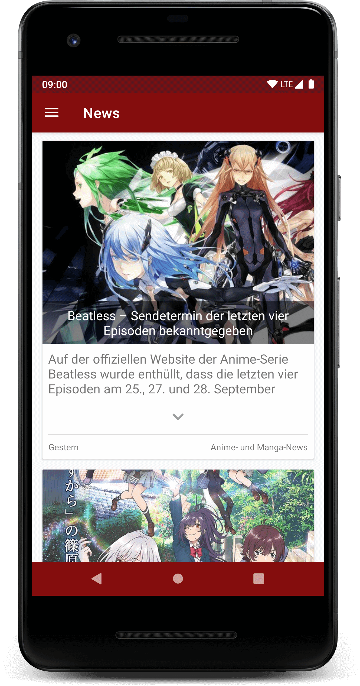 | 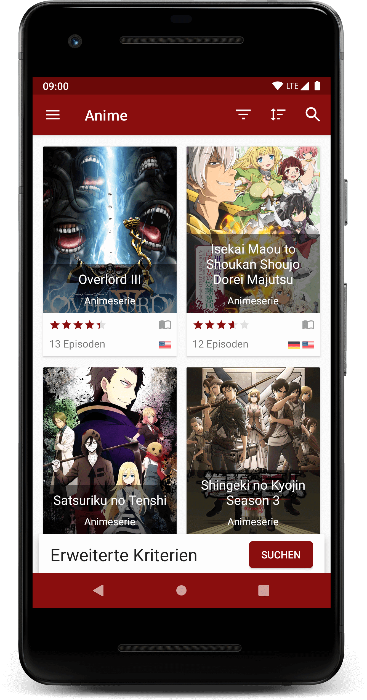 | 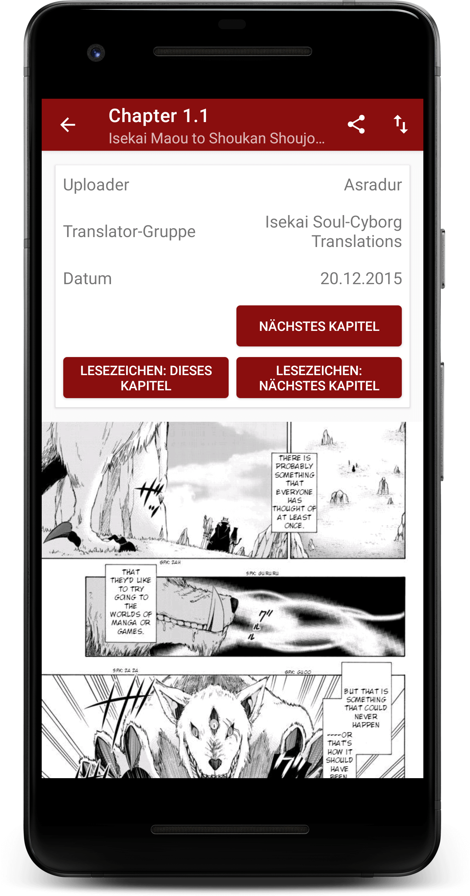 |

| Media Detail                         | Instant Chat                            | Public Chat                         |
|--------------------------------------|-----------------------------------------|-------------------------------------|
| 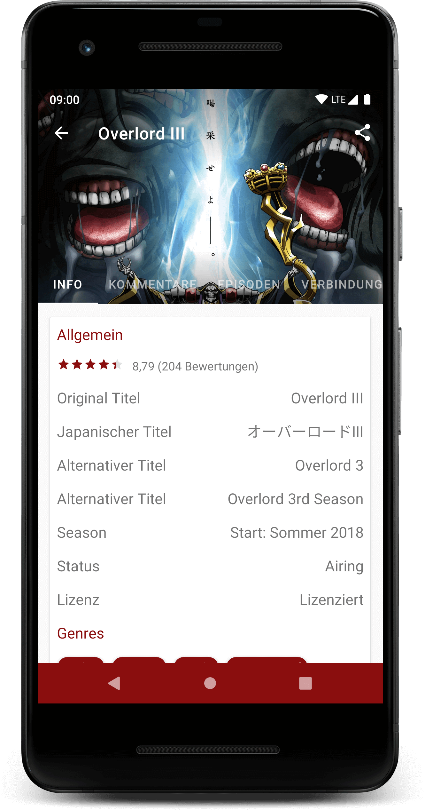 | 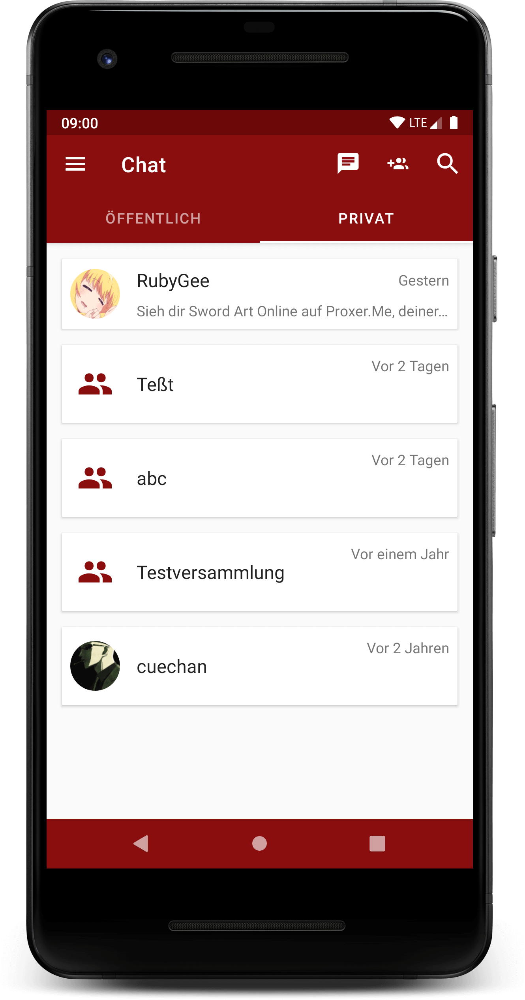 | 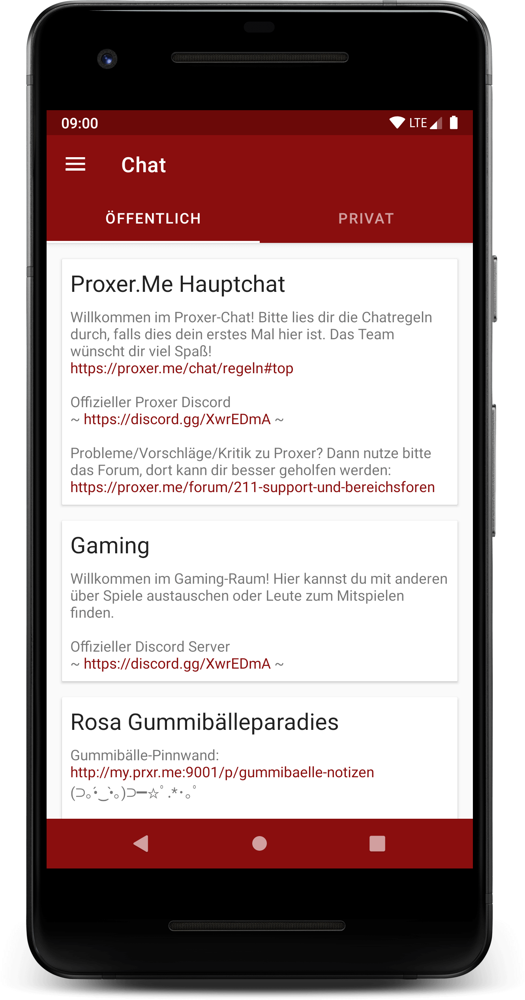 |

| Anime Stream List                     | Anime Player                       |
|---------------------------------------|------------------------------------|
| 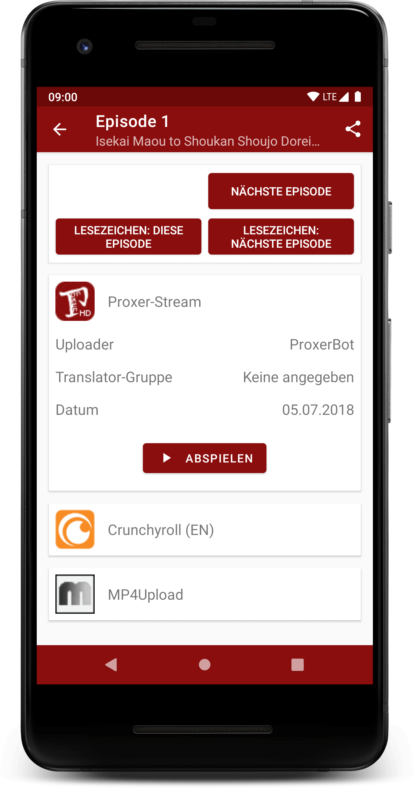 | 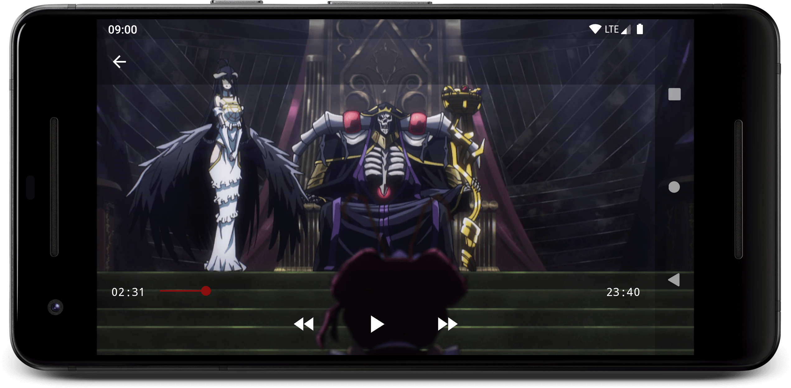 |

| Profile Overview                | Profile Top Ten                    | Profile Media List               |
|---------------------------------|------------------------------------|----------------------------------|
| 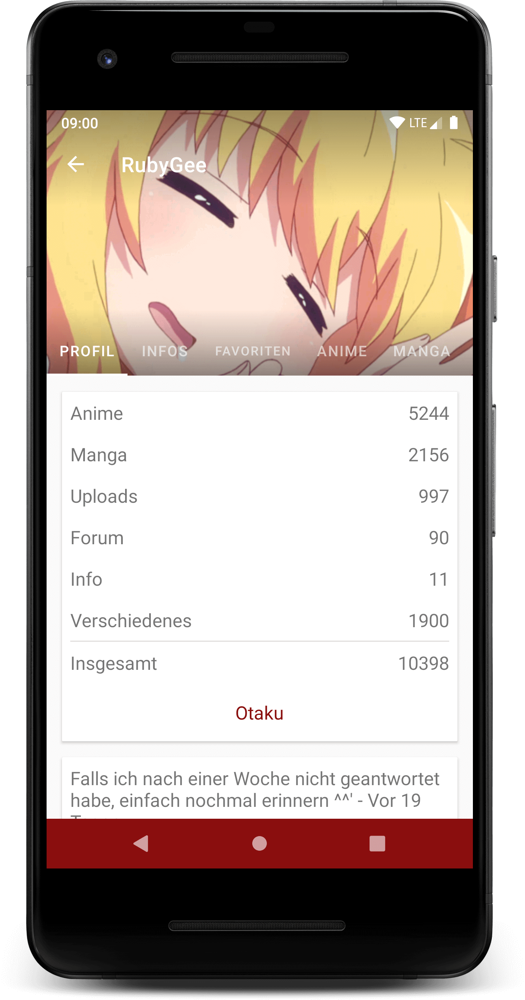 | 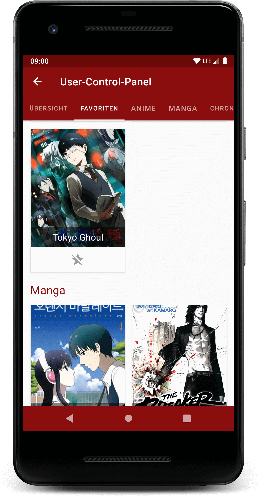 | 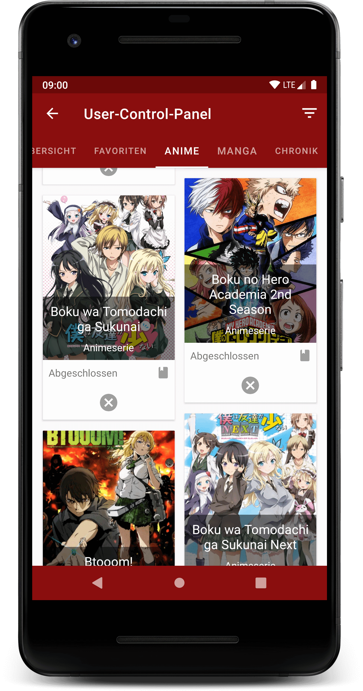 |

### Contributions and contributors

A guide for contribution can be found [here](.github/CONTRIBUTING.md).

- [@InfiniteSoul](https://github.com/InfiniteSoul) for implementing a persistent Navigation Drawer for tablets and UI improvements.
